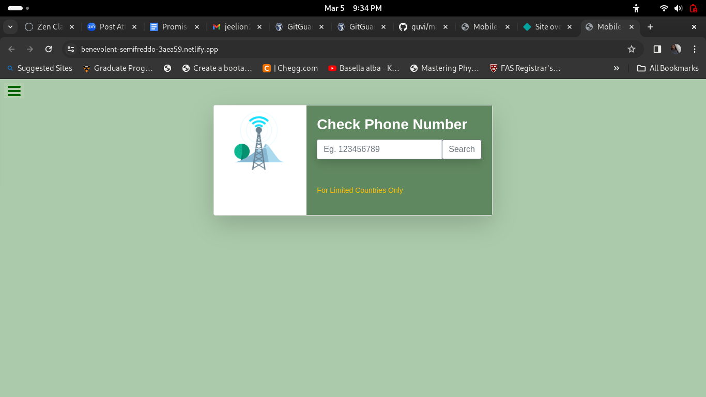

# Mobile Number Finder

The webpage can be used to extract informations about mobile and landline numbers.

Brief description of the project.

## Table of Contents

- [Introduction](#introduction)
- [Project Images](#Images)
- [Installation](#installation)
- [Usage](#usage)
- [License](#license)

## Introduction

In this web page, mobile and landline numbers informations can be found. The inputs may either include country code. It is optional. For the country of India, the country code (+91) should be prefixed in the input numbers. For other countries, it works well. The information of the numbers like country, carrier, international and local format of the number, location, and type of the connection such that mobile or landline will be available if the given number is valid.

[Netlify link](https://benevolent-semifreddo-3aea59.netlify.app/)

## Images

## Installation

No installation is required except a latest web browser.

## Usage

It can be used for getting some basic mobile and landline number information.

## License

MIT License

---

